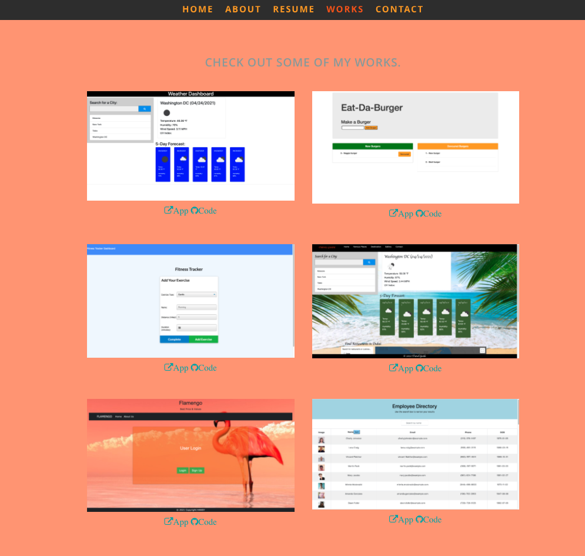

# reactPortfolio

## Description
Hi! My name is Natalia Sozontova and this is repository for my React Portfolio website.

## Table of Contents
* [Features](#features)
* [Installation](#installation)
* [Technologies Used](#technologies-used)
* [Contribution Guidlines](#contribution-guidlines)
* [License](#license)

## Features

* HOME

* ABOUT

* RESUME

* WORKS

* CONTACT

## Installation 
* Clone this repository.
https://github.com/NataliaSozontova/reactPortfolio/tree/gh-pages

* Open application live URL in your browser.
https://nataliasozontova.github.io/reactPortfolio/#about

## Support
Please email me for further questions at nasozontova@gmail.com

## Technologies Used
* NodeJS
* JavaScript
* Express
* ReactJS
* HTML
* CSS

## Contribution Guidlines
Direct link to repository: 
https://github.com/NataliaSozontova/reactPortfolio/tree/gh-pages

## License
Copyright(c) 2021 Natalia Sozontova.